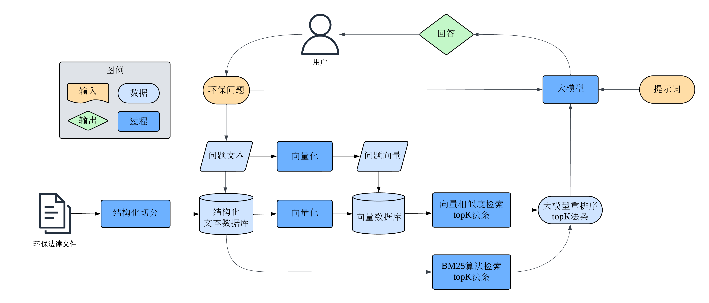
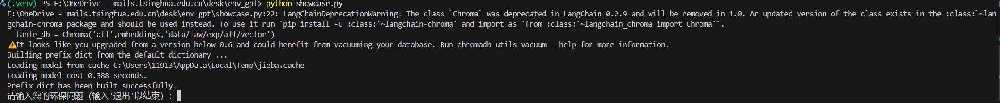
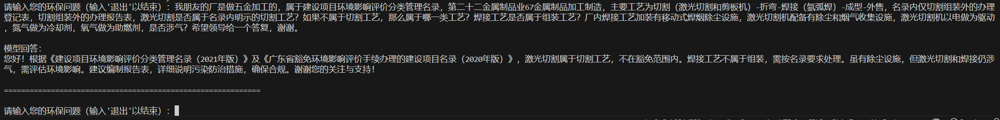

# 环保垂类大模型操作参考文档

## 目录

0. [整体架构](#整体架构)
1. [依赖管理](#依赖管理)
2. [环境变量](#环境变量)
3. [知识库](#知识库)
   1. [知识库概述](#1-知识库概述)
   2. [数据解析流程](#2-数据解析流程)
      - [PDF 转 Markdown](#21-pdf-转-markdown)
      - [Markdown 转 TXT](#22-markdown-转-txt)
      - [文本切分及向量化](#23-文本切分及向量化)
4. [提示词工程](#提示词工程)
   1. [提示词设计要点](#提示词设计要点)
5. [大模型问答（问题 → 回复）](#大模型问答问题--回复)
   1. [操作步骤](#操作步骤)
6. [指标评估（回复 → 评价分数）](#指标评估回复--评价分数)

## 整体架构

<div align="center">
  
</div>

## 依赖管理

请在命令行中运行以下命令安装依赖

```bash
pip install requirements.txt
```

## 环境变量

请在主路径新建`API_KEY.env`文件用于储存 API，文件内部构造如下

```API_KEY.env
QWEN_KEY = xxxxxxxxxxx
OPENAI_KEY = xxxxxxxxxxx
```

## 知识库

### 1. 知识库概述

知识库是系统中储存环保领域法律知识的核心部分。原始文档为 PDF 或 TXT 格式，通过解析后转为向量格式供检索使用。

- **存储路径：**

  - 文本文件：`data/law/exp/.../text/`
  - 向量数据文件：`data/law/exp/.../vector/`

- **组织方式：**
  不同领域的法律文件按类别存放。例如：`data/law/exp/huanping/` 用于存放环评相关法律文件。

### 2. 数据解析流程

由于法律文件经常由 pdf 文件组成，然而大模型不能直接识别 pdf 文件，故我们需要做数据解析

#### 2.1 PDF 转 Markdown

- **目标：** 将非结构化的 PDF 文档转化为结构化的 Markdown 文档，保留表格、段落等信息。
- **工具：** 使用 [LLAMAIndex](https://cloud.llamaindex.ai/landing) 提供的服务。

#### 2.2 Markdown 转 TXT

- **原因：** Markdown 文档包含格式化字符（如 `#`、`*`、`|` 等），会影响嵌入模型的语义识别效果，需转化为纯自然语言文本。
- **使用模型**：OpenAI, KIMI, ZHIPU 等通用大模型
- **示例提示词**：

```
请严格按照以下格式将表格的内容全部转化为自然语言文本形式的知识库：
来自卫生行业的医疗废物（HW01）属于感染性废物，废物代码841-001-01，危险特性为感染性（ln）
废物代码前三位代表行业，如841代表卫生行业，废物代码后两位代表废物类别，01属于HW01医疗废物，请遵循该规则对表格进行解析
要求：不同行业直接打空行，输出为方便复制粘贴的格式，内容的完整性和准确性是排在第一位的！！！
| 废物类别 | 行业来源 | 废物代码 | 危 险 废 物 | 危险特性¹ |
|----------|----------|----------|-------------|-----------|
| HW01<br>医疗废物² | 卫生 | 841-001-01 | 感染性废物 | In |
...
```

#### 2.3 文本切分及向量化

- **目标：** 将长文档切分为小段落，每段独立向量化，便于后续检索。
- **方法：**
  - **切分：** 使用正则表达式按章节或条款切分，确保每段语义完整。
  - **向量化：** 使用 `text-embedding-ada-002` 嵌入模型。
  - **存储：** 向量化结果存储于 Chroma 数据库。
- **参考代码：**
  - [`exp/all/src/embed_nn.py`](exp/all/src/embed_nn.py)
  - [`exp/all/src/embed_tiao.py`](exp/all/src/embed_tiao.py)

## 提示词工程

提示词是优化大模型表现的关键，需根据具体应用场景设计高质量提示词。

### 提示词设计要点

- **角色设定：**
  设定模型为政府工作的环保法律专家，确保回答权威且专业。

- **回答思路：**
  针对环评类问题，回答需包含以下步骤：

  1. 判断问题所属行业；
  2. 从知识库中检索相关法条；
  3. 基于法条内容进行分析；
  4. 提供可操作性建议。

- **格式要求：**

  - 使用礼貌用语，如“您好”“感谢您的支持”等；
  - 回答字数不超过 200 字；
  - 逻辑清晰、语言简洁且权威。

- **参考案例：**
  可参考文件：[`exp/huanping/prompt.txt`](exp/huanping/prompt.txt)，其中包含优化提示词的详细示例。

## 大模型问答（问题 → 回复）

### 操作步骤

1. **密钥管理：**
   - 将 ZHIPU 和 OPENAI 的 API 密钥存放在 `API_KEY.env` 文件中，确保密钥安全。
   - ZHIPU API 的获取地址如下[智谱\_API](https://www.bigmodel.cn/usercenter/proj-mgmt/apikeys)
   - OPENAI API 的获取地址如下[OPENAI_API](https://platform.openai.com/api-keys)
2. **调用方式：**
   用户问题首先会进入预先准备的法律文本知识库中检索 5 个最相关的法律片段，结合系统提示词通过 API 调用的方式输入给 ZHIPU 大模型。调用完成后会返回最终回答。

- **运行代码：** ：
  ```bash
  python showcase.py
  ```
- **运行界面：**
<div align="center">

</div>

- 此时输入你的问题，目前该系统只支持环评，排污许可和固危废类问题

- **预计输出：**
<div align="center">

</div>

---

## 指标评估（回复 → 评价分数）

- 评估系统生成回复的质量是优化模型表现的重要环节，主要用于算法优化时的评估标准

- **运行代码：** ：

  ```bash
  python .\test\test_combined.py
  ```

- **输入** ：储存 .txt 格式问答文件的文件夹
- **输出** ：.xlsx 文件
- 运行时需根据实际评估的文件修改 138 行的测评文件夹 `directory = 'xxx'`及 178 行的输出文件`output_path = 'xxx'`
- **详细标准：** 该模块与业务中的问答模块并无关系，故不在此处展开论述，若想了解详情可参考 [`evaluation.md`](evaluation.md)
